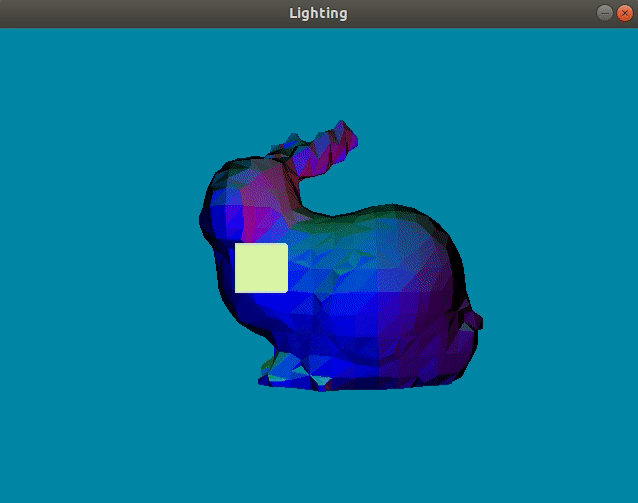

# Graphics-Portfolio

Compilation of Computer Graphics Projects. This repository includes projects that are part of an academic course. The description for each project is in their respective branch, but the code is available upon request and is not posted publicly since it's a part of an academic course.

# 3D Modeling Project

## Description

This project is part of an assignment to learn and practice 3D modeling skills using Blender3D or another 3D modeling tool. The goal was to create a unique 3D object with no more than 1,000 triangles and export it in the .obj format.

---

## .obj Model Renderer

### Description

This project is a .obj model renderer implemented in C++ using SDL2 and OpenGL.

The .obj model renderer can load and display 3D models in the wavefront .obj format. It includes support for rendering models in wireframe mode and allows for interactive control of the rendering.

---

## Normal Mapped OBJ Model Renderer

### Description

This project implements a renderer for 3D models in OBJ format with normal mapping support. It uses OpenGL for rendering and SDL2 for window management and input handling.

---

## Phong Illumination and Point Light(s) Assignment

### Description

This assignment focuses on implementing the Phong illumination model and working with point lights in a 3D graphics application. The project builds upon previous work with .obj file loading and adds sophisticated lighting effects.

---

## Textured .obj Model Renderer

### Project Description

This project implements a 3D renderer capable of loading and displaying textured .obj models with OpenGL. It features perspective projection, interactive camera controls, and the ability to toggle between filled and wireframe rendering modes.

