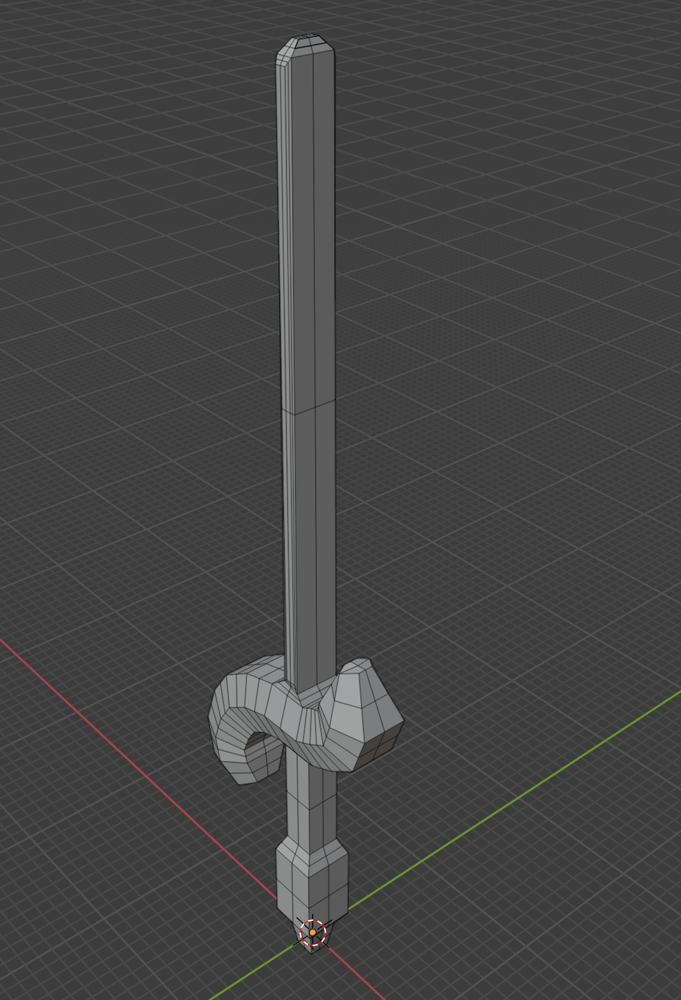

# 3D Modeling Project

## Description

This project is part of an assignment to learn and practice 3D modeling skills using Blender3D or another 3D modeling tool. The goal was to create a unique 3D object with no more than 1,000 triangles and export it in the .obj format.

## Project Structure

- The 3D model file (.obj) is located in the `./../../common/objects` directory of the monorepo.

## Tools Used

- Blender3D (or specify the 3D modeling tool you used)

## Object Details

- Name: Hetan Thakkar
- Description: Sword made in Blender

## Process

1. Learned basic 3D modeling techniques using tutorials and resources provided.
2. Brainstormed and sketched ideas for a unique 3D object.
3. Created the 3D model using Blender3D (or your chosen tool).
4. Ensured the model stayed within the 1,000 triangle limit.
5. Exported the model in .obj format with triangulated faces.
6. Committed the .obj file to the specified directory in the monorepo.

## Screenshot

