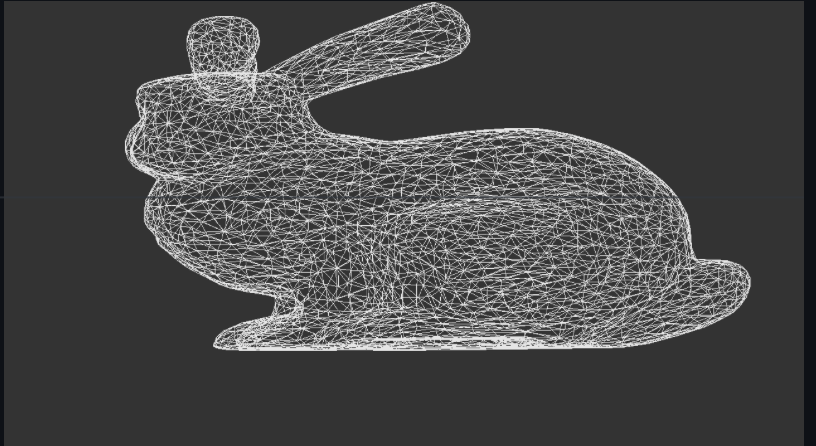

# .obj Model Renderer

This project is a .obj model renderer implemented in C++ using SDL2 and OpenGL.

## Description

The .obj model renderer can load and display 3D models in the wavefront .obj format. It includes support for rendering models in wireframe mode and allows for interactive control of the rendering.

## Features

- Load and display .obj models
- Render models in wireframe mode
- Interactive control:
  - Press 'w' key to toggle wireframe mode
  - Press 'q' key to exit the application
  - Press '1' key to render a .obj model read in from the command-line
  - Press '2' to '9' keys to render other objects read in from the command-line

## Screenshot

